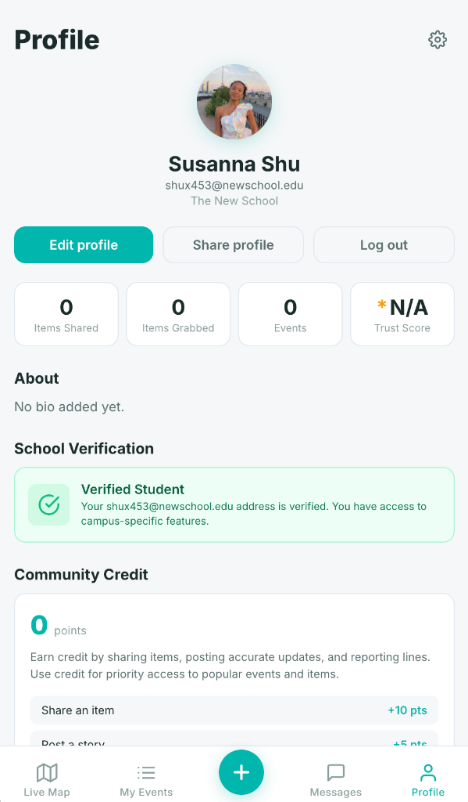
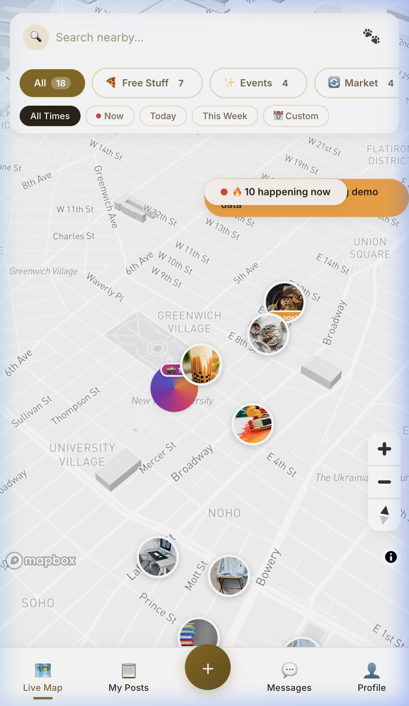
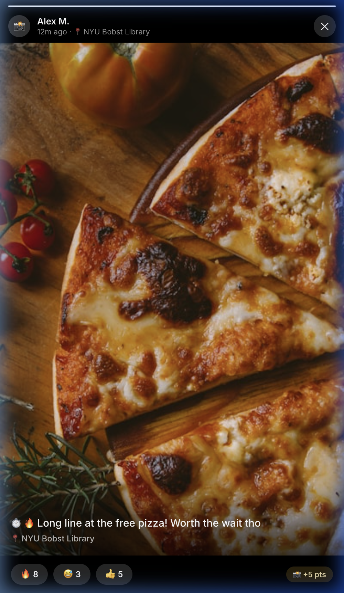
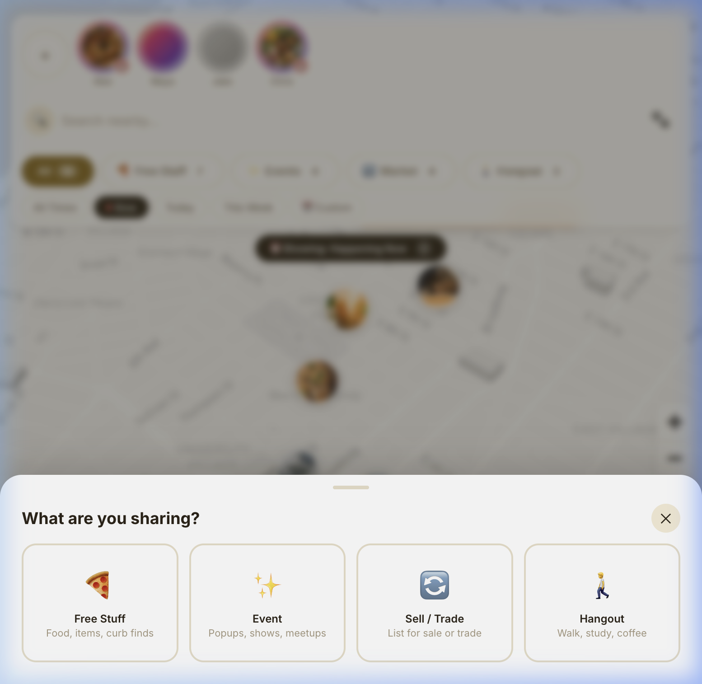
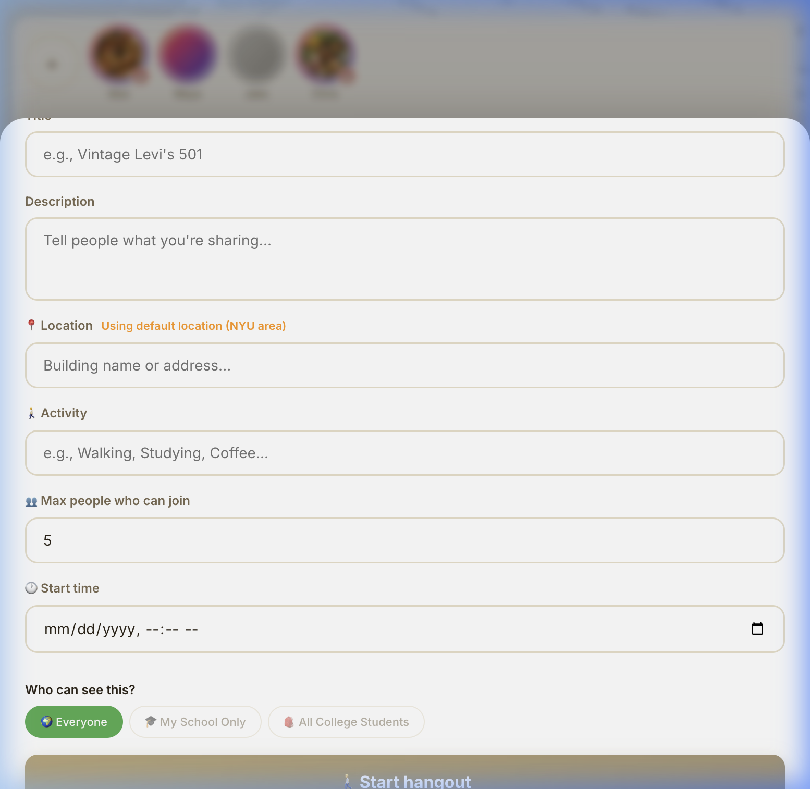
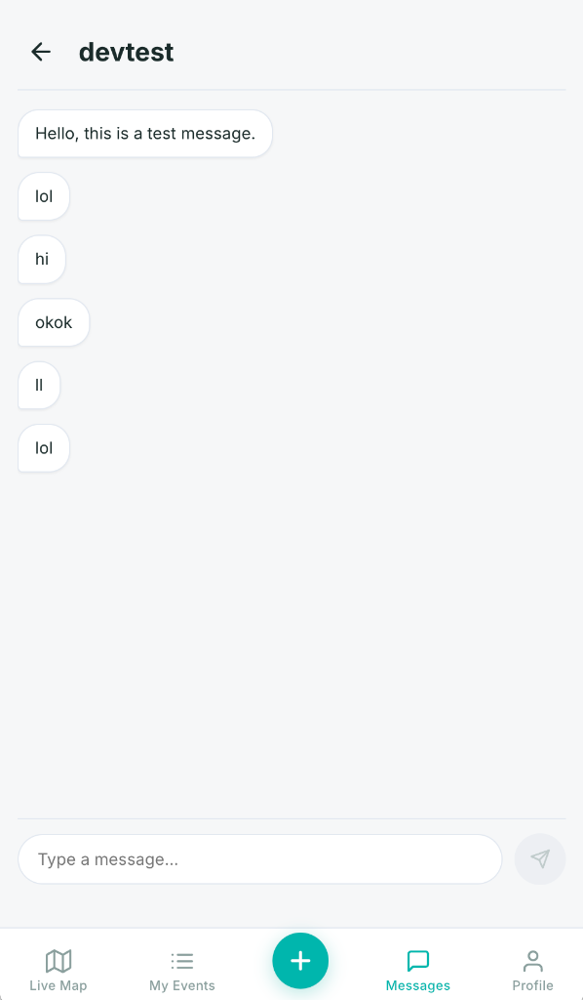
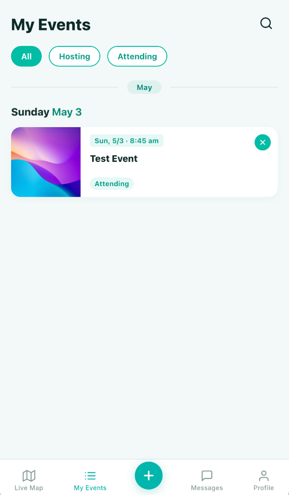

<p align="center">
  
  
  
</p>

> **This repository is for display purposes only.** It showcases the UI, interaction design, and frontend architecture of SUSU Map. All data is hardcoded mock data -- no backend is required to run this app. The production version with real-time data, authentication, and backend integration is maintained in a private repository.

---

# SUSU Map -- Hyperlocal Campus Community Map

A real-time, community-powered map for college campuses. Students can share free items, post events, list marketplace goods, organize spontaneous hangouts, and stay informed about what is happening around them -- right now.

## Screenshots

<p align="center">
  
  
  
</p>
<p align="center">
  <em>Map with story rings</em> · <em>Pin detail with live stories</em> · <em>Full-screen story viewer</em>
</p>

<p align="center">
  
  
  
</p>
<p align="center">
  <em>Time-based filtering</em> · <em>4 post types</em> · <em>Hangout + access scope</em>
</p>

<p align="center">
  
  
  
</p>
<p align="center">
  <em>Profile + community credit</em> · <em>Messaging</em> · <em>My Events</em>
</p>

## Features

- **Multi-Layer Map** -- Toggle between Free Stuff, Events, Marketplace, and Hangout layers
- **Time Filtering** -- Filter pins by "Happening Now", "Today", "This Week", or custom ranges
- **Live Stories** -- Instagram-style photo/video updates attached to map pins
- **Community Credit** -- Gamified reputation system that rewards sharing and accuracy
- **School Verification** -- .edu email verification for campus-only content
- **Access Scoping** -- Posts can be public, school-only, or college-network-only
- **Messaging** -- Direct messaging between users for coordination
- **Hangout Matchmaking** -- Spontaneous group activity finder with join/leave mechanics

## Architecture

```
src/
  components/       # React components (map, modals, sheets, navigation)
  data/
    mockData.ts      # All demo data (pins, stories, layer config)
  store/
    store.ts         # Redux store (minimal, no API middleware)
    authSlice.ts     # Hardcoded demo user
    communityApi.ts  # Mock data accessors (replaces RTK Query API layer)
  types.ts           # TypeScript interfaces
  index.css          # Design system tokens and global styles
  App.tsx            # Root component with tab navigation
```

## Tech Stack

| Layer | Technology |
|-------|-----------|
| Framework | React 19 + TypeScript |
| Build | Vite 8 |
| Map | Mapbox GL JS |
| State | Redux Toolkit |
| Styling | Vanilla CSS with design tokens |
| Notifications | react-hot-toast |

## Getting Started

```bash
# Clone
git clone https://github.com/yourusername/susu-map-display.git
cd susu-map-display

# Install dependencies
npm install

# Set up environment
cp .env.example .env
# Edit .env and add your Mapbox access token

# Run dev server
npm run dev
```

The app will start at `http://localhost:5173` with all mock data pre-loaded. No backend needed.

## Production Version

The production version (private repository) includes:

- Real-time data sync via REST backend + Socket.IO
- OAuth authentication (Google, Apple) and JWT session management
- Image uploads via Cloudinary
- .edu email verification with code-based flow
- Full CRUD operations for posts, stories, and messages
- RTK Query API layer with cache invalidation
- WebSocket-driven live pin updates

## License

MIT
